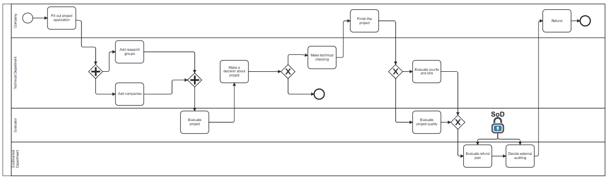
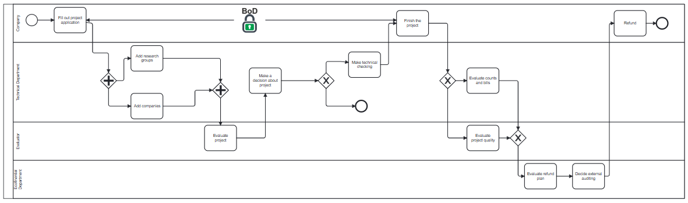
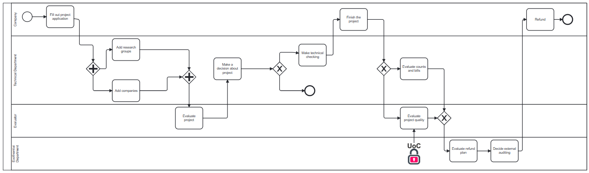

# CEP4BPMSec

## Prerequisites

Before running the project, ensure that you have the following software installed:

### Global Requirements

1. **Git**
   - For cloning the repository and version control.
   - [Download Git](https://github.com/ajvarela/caise2025/)
   - Verify installation:
     ```bash
     git --version
     ```

2. **Java Development Kit (JDK) 1.8 or higher**
   - Required for the **Engine** module.
   - [Download JDK](https://www.oracle.com/java/technologies/javase-downloads.html)
   - Verify installation:
     ```bash
     java -version
     ```

3. **Apache Maven**
   - Required for building the **Engine** module.
   - [Download Maven](https://maven.apache.org/)
   - Verify installation:
     ```bash
     mvn -version
     ```

4. **Node.js v16 or higher**
   - Required for the **Backend** and **Modeler** modules.
   - [Download Node.js](https://nodejs.org/)
   - Verify installation:
     ```bash
     node -v
     npm -v
     ```

### Module-Specific Requirements

#### Backend

- **Dependencies** are specified in `backend/package.json`.

- **Install Dependencies**:
```bash
cd Backend
npm install
```

#### Modeler

- **Dependencies** are specified in `modeler/package.json`.

- **Install Dependencies**:
```bash
cd Modeler
npm install
```

#### Engine

- **Dependencies** are specified in `engine/pom.xml`.

- **Build the Engine Module**:
```bash
cd Engine
mvn clean install
```

## How to Run the Project

Once all prerequisites are installed, you can run the entire project with a single command:

 1. **Navigate to the Root Folder**:
```bash
cd CEP4BPMSec
```

 2. **Run the project**:
On Windows, execute the following command from the root directory:
```bash
./run.bat
```
This script will handle the execution and orchestration of all modules.

## How to Test the Compliance Function

Once the project is running, you should follow this steps to test the compliance function:

 1. **Select an scenario from eventLogs**:
Below are the four scenarios available for testing. Each represents a different event log structure:

- **Scenario 1 and Scenario 2:** BoD policy, Scenario 1 are 10 instances from the model, and scenario 2 are 100 instances.
  

- **Scenario 3 and Scenario 4:** SoD policy, Scenario 1 are 10 instances from the model, and scenario 2 are 100 instances.
  

- **Scenario 5 and Scenario 6:** UoC policy, Scenario 1 are 10 instances from the model, and scenario 2 are 100 instances.
  

- **Scenario 7 and Scenario 8:** SoD+BoD+UoC policies, Scenario 1 are 10 instances from the model, and scenario 2 are 100 instances.
  

 2. **Copy and paste the selected scenario to the folder eventFile**:
Scenario1 is selected as a default scenario, delete it from eventFile to test more easily other scenarios.

 3. **Finally, click on the Compliance button to test the function**.